```{r setup, include=FALSE, warning=FALSE}
library(knitr)
hook_output <- knit_hooks$get("output")
knit_hooks$set(output = function(x, options) {
  lines <- options$output.lines
  if (is.null(lines)) {
    return(hook_output(x, options))  # pass to default hook
  }
  x <- unlist(strsplit(x, "\n"))
  more <- "..."
  if (length(lines)==1) {        # first n lines
    if (length(x) > lines) {
      # truncate the output, but add ....
      x <- c(head(x, lines), more)
    }
  } else {
    x <- c(more, x[lines], more)
  }                                                         
  # paste these lines together                              
  x <- paste(c(x, ""), collapse = "\n")                     
  hook_output(x, options)                                   
})                                                          
knitr::opts_chunk$set(echo = TRUE)                          
knitr::opts_chunk$set(cache = TRUE) 
knitr::opts_chunk$set(echo = TRUE, fig.align="center")
Sys.setlocale("LC_ALL", "Polish")
```
# Wstęp

Celem pracy jest zaprezenowanie działania dwóch algorytmów optymalizacji -
Metody Fibonacciego oraz Metody Bisekcji (gradientowa). Praca dostępna jest
w dwóch wersjach - PDF oraz Rmarkdown.

Rmarkdown to wersja interaktywna, uruchamiana w RStudio, pozwalająca na zweryfikowanie
poprawności działania prezentowanych algorytmów.

# Problem

Dystans Ziemia-Mars zależy od ich pozycji na orbitach i zmienia się w czasie. 
Zadaniem jest obliczenie najmniejszego dystansu na jaki planety te zbliżą się.
Dla ułatwienia orbity obu planet zostaną zamodelowane z pomocą elips i liczb zespolonych.


# Pozycja planety w dowolnym punkcie czasu

Pozycje planet mogą być modelowane z pomocą liczb zespolonych^[https://www.johndcook.com/blog/2015/10/24/distance-to-mars/]. 
Oto równanie  pozwalające na symulację ruchu planety. Zostanie ono odpowienio przeskalowane 
poprzez dostosowanie parametru $r$. Model zakłada, że początkowy kąt między planetami
wynosi 0 rad.

$$
planet(t) = r * exp \left(2 \cdot \pi i r^{\frac{-3}{2}} t \right)
$$

- $r$ - półoś wielka orbity planety (elipsy)
- $AU$ - jednostka astronomiczna 149 597 870 700 m
- $t$ - czas^[jednostka nie ma znaczenia, ponieważ szukamy najmniejszej odległości]

# Elipsa

Oto model orbity. Dostosowując parametr $r$ (na rys $a$), możemy modelować 
dowolną z planet.

- $a$ - półoś wielka elipsy
- $b$ - półoś mała elipsy


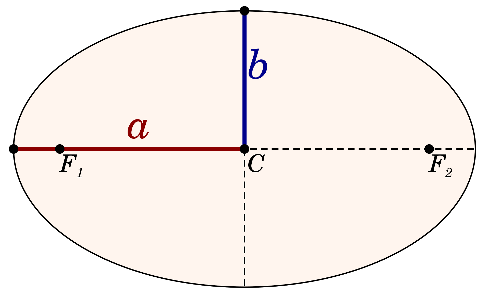{width=70%}

# Równanie dla ziemi i marsa

Ponieważ półoś wielka orbity Ziemi wokół słońca to $1 AU$ przyjmiemy parametr $r = 1 AU$.

$$
earth(t) = exp \left(2 \cdot \pi \cdot i \cdot t \right)
$$

Ponieważ półoś wielka orbity Marsa wokół słońca to $1.524 AU$ przyjmiemy parametr $r = 1.524 AU$.

$$
mars(t) = 1.524 * exp \left(2 \cdot \pi \cdot i \cdot (1.524)^{\frac{-3}{2}} \cdot t \right)
$$

# Równanie dla ziemi i marsa - kod w R

```{r}
r = 1.524 # półoś wielka orbity Marsa w AU

earth <- function(t){ exp(2*pi*1i*t) }

mars <- function(t) { r*exp(2*pi*1i*(r**-1.5*t)) }
```

Odległość między planetami można wyznaczyć jako wartość bezwzględą z różnicy 
w ich pozycjach w czasie $t$.

$$
f(t) = abs \left( mars(t) - earth(t) \right)
$$

```{r}
f <- function(x) { abs(mars(x) - earth(x)) }
```

# Wykres funkcji odległości planet

```{r, fig.cap = 'Wykres funkcji distance(t)', echo=FALSE, out.width = '80%'}
plot(f, xlim = c(0, 5), ylim = c(0, 3), xlab = "Time", ylab = "Distance [AU]")
```

# Wykres funkcji odległości planet - porównanie z sin

Przeskalowana funkcja $sin(x)$ na czerwono. Funkcja dystansu przypomina funkcję 
sinus, ale jak widać na wykresie poniżej nie są identyczne.

```{r, fig.cap = 'Wykres funkcji distance(t)', echo=FALSE, out.width = '60%'}
plot(f, xlim = c(0, 5), ylim = c(0, 3), xlab = "Time", ylab = "Distance [AU]")
plot(function(x) sin(2.85*x - 1.4) + 1.5, xlim = c(0, 5), ylim = c(0, 3), xlab = "Time", ylab = "Distance [AU]", add=TRUE, col="red")
```
# Metody bezgradientowe 

Zadanie zostanie roziwązane korzystając z metody Fibonacciego. Do jej implementacji
będzie potrzebny *Ciąg Fibonacciego*, który zdefiniowany jest jako:
$$
F(0) = 0, F(1) = 1, F_n = F_{n-1} + F_{n-2}
$$

# Obliczenie Ciągu Fibonacciego
\small
```{r}
# Obliczenie pierwszych 101 wyrazów ciągu fib
phil <- c(rep(0, 100))
phil[1:3] <- c(1,1,1)
for(i in c(3:length(phil))) {
  phil[i] = phil[i-1] + phil[i-2]}

phi <- function(i) {
  if(i <= 0) {return(0)}; # F(0) = 0
  # Obliczenie nowych elementów jeżeli wyjdziemy poza zakres
  if (i > length(phil)) { 
    len <- length(phil)
    phil <- c(phil, rep(0, i - len))
    for(j in c(len:length(phil))) {phil[j] = phil[j-1] 
      + phil[j-2]}
  }
  return(phil[i])
}
```
\normalsize

# Metoda Fibonacciego
Metoda ta opiera się na metodzie zawężania początkowego przedziału poszukiwania.
Zaczynamy od wybrania przedziału $[a, b]$. Nastepnie w każdej iteracji obliczamy
punkty $c^{(i)}$ oraz $d^{(i)}$, tak aby spełniały:
$$
b^{(i)} - d^{(i)} = c^{(i)} - a^{(i)}
$$
oznacza to, że są równo oddalone od aktualnego przedziału przeszukiwań.


# Jak działa zawężanie przedziału poszukiwań
- Gdy: $f(c) < f(d)$, wtedy $a^{(i+1)} = a^{(i)}, b^{(i+1)} = d^{(i)}$
- Gdy: $f(d) < f(c)$, wtedy $a^{(i+1)} = c^{(i)}, b^{(i+1)} = b^{(i)}$

```{r, echo=FALSE, out.width = '80%'}
fun <- function(x){x^2}
plot(fun, -2, 2)
xp <- c(-1,-0.5, 1,1.5)
yp <- fun(xp)
points(xp, yp, pch=19)
text(xp+0.1,yp+0.1, c("a","c","d", "b"))
```

# Metoda Fibonacciego

Wyznaczanie punktów $c^{(i)}$ oraz $d^{(i)}$. 
$$
c^{(i)} = b^{(i)} - \alpha^{(i)} \cdot \left( b^{(i)} - a^{(i)} \right)
$$

$$
d^{(i)} = a^{(i)} + b^{(i)} - c^{(i)}
$$

$$
\alpha^{(i)} = \frac{\phi_{k-i-1}}{\phi_{k-i}}
$$

$$
\phi_k = min \{ F(k): F(k) > \frac{L}{\epsilon} \}
$$
Gdzie: $F(k)$ to k-ty wyraz *Ciągu Fibonacciego*, $L$ = | a - b |, $\epsilon$ - zadana dokładność

# Obliczenie ilości iteracji
Z kryterium obliczającego $phi_k$ wiemy, że należy wykonać k-2 iteracji.
Gdyż pierwsze wartości w ciągu fibonacciego są 1 i 0, więc wartość parametru 
$alpha$ wyniesie 1 i 0 (dla iteracji $k-1$ i $k$), a więc nie dokona się już
zawężenie przedziału.
Ponadto ze względu na błędy zaokrągleń, zwiększam liczbę iteracji o 1.

```{r}
phi_k <- function(a, b, tol) {
  i <- 1
  L <- b - a
  while(phi(i) < L / tol) {i <- i+1}
  return(i + 1) # Dodaję jedną iterację
}
```

# Metoda Fibonacciego implementacja - kod w R

```{r}
fib <- function(f, a, b, tol) {
  k <- phi_k(a, b, tol)
  for(i in c(0:(k-3))) {
      alpha <- phi(k-i-1)/phi(k-i)
      c <- b - alpha*(b - a)
      d <- a + b - c
      cat("iteracja=", i+1, "a=", a, "c=",c,"d=",d,"b=", 
          b , "alpha=", alpha,"\n",sep=" ")
      if( f(c) < f(d) ) {
        b <- d
      } else {
        a <- c
      }
  }
  return((a+b)/2)
}
```

# Rozwiązanie - metoda Fibonacciego - wynik

\tiny
```{r}
fib(f, 1.5, 2.5, 1e-3)
```
\normalsize

# Rozwiązanie - wykres

```{r, echo=FALSE, results='hide'}
x_min <- fib(f, 1.5, 2.5, 1e-3)
y_min <- f(x_min)
plot(f, xlim=c(1.5, 2.5))
points(x_min, y_min)
```

# Wizualizacja 

Aby pokazać jak dokładnie działa algorytm, na następnych slajdach umieściłem
wizualizację. Krok po korku prześledzić można kolejne kroki algorytmu oraz 
to w jaki sposób wybiera punkt zawężający przedział. Ze względu na to iż
ilość iteracji algorytmu może wynosić powyżej 6, gdzie przy takim zawężeniu
zmiana wartości nie będzie widoczna na wykresie (przy *xlim=c(a, b)*), wprowadziłem
parametr *max_iter*. Wszystkie wyresy zostały wygenerowane z pomocą kodu na następnym
slajdzie.

# Wizualizacja - Fibonacci - kod
\tiny
```{r animacja, cache=TRUE}
fib_anim <- function(f, a, b, tol, max_iter) {
  k <- phi_k(a, b, tol)
  lower <- a
  upper <- b
  for(i in c(0: min((k-3), max_iter))) {
      alpha <- phi(k-i-1)/phi(k-i)
      # FIRST PLOT 
      plot(f, xlim=c(lower, upper))
      points(xp <- c(a,b), yp <- f(xp))
      text(xp+0.02, yp+0.02, c("a", "b"))
      dev.print(png, paste("img/", 3*i + 1, ".png", sep=""), width = 400, height = 400)
      c <- b - alpha*(b - a)
      d <- a + b - c
      # SECOND PLOT 
      plot(f, xlim=c(lower, upper))
      points(xp <- c(a,b,c, d), yp <- f(xp))
      text(xp+0.02, yp+0.02, c("a", "b", "c", "d"))
      dev.print(png, paste("img/", 3*i + 2, ".png", sep=""), width = 400, height = 400)
      # THIRD PLOT 
      plot(f, xlim=c(lower, upper))
      points(xp <- c(a,b,c, d), yp <- f(xp))
      text(xp+0.02, yp+0.02, c("a", "b", "c", "d"))
      if( f(c) < f(d) ) {
        arrows(b, f(b), d, f(d), col="red")
        b <- d
      } else {
        arrows(a, f(a), c, f(c), col="red")
        a <- c
      }
      dev.print(png, paste("img/", 3*i + 3, ".png", sep=""), width = 400, height = 400) }
  return((a+b)/2)
}
fib_anim(f, 1.5, 2.5, 1e-3, 4)
```
\normalsize


# Wizualizacja - Fibonacci - animacja

\centering


# Wizualizacja - Fibonacci - animacja

\centering


# Wizualizacja - Fibonacci - animacja

\centering
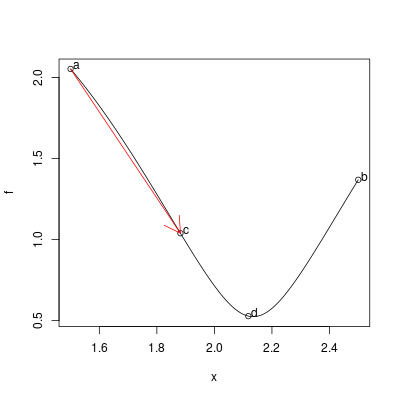

# Wizualizacja - Fibonacci - animacja

\centering


# Wizualizacja - Fibonacci - animacja

\centering


# Wizualizacja - Fibonacci - animacja

\centering
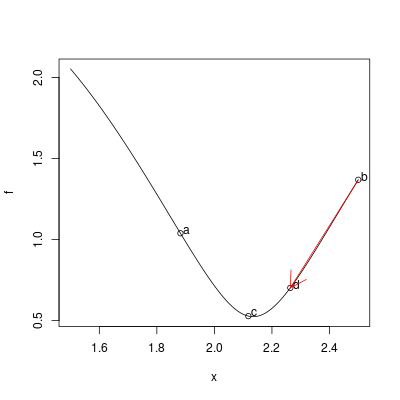

# Wizualizacja - Fibonacci - animacja

\centering


# Wizualizacja - Fibonacci - animacja

\centering


# Wizualizacja - Fibonacci - animacja

\centering
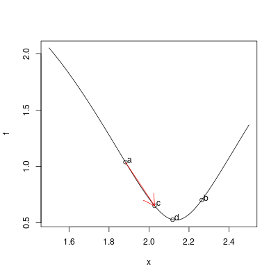

# Wizualizacja - Fibonacci - animacja

\centering


# Wizualizacja - Fibonacci - animacja

\centering


# Wizualizacja - Fibonacci - animacja

\centering
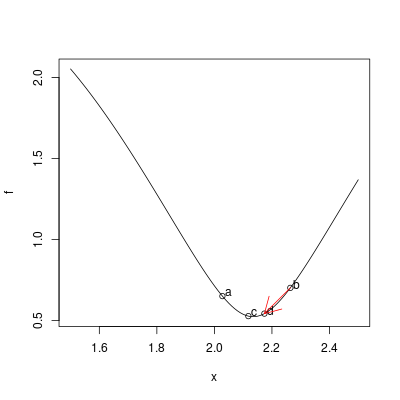

# Wizualizacja - Fibonacci - animacja

\centering


# Wizualizacja - Fibonacci - animacja

\centering


# Wizualizacja - Fibonacci - animacja

\centering
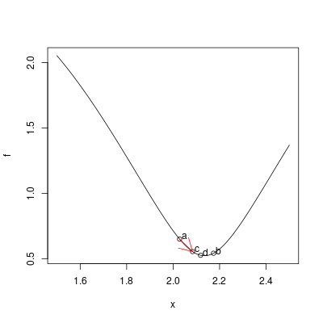


# Metoda bisekcji

Metoda ta do znalezienia minimum/maximum wykorzystuje **alborytm bisekcji**. 
Algorytm bisekcji znajduje miejsce zerowe dowolnej ciągłej funkcji. Wykorzystuje
on fakt, że funkcja zmienia znak po przejściu przez miejsce zerowe. Mając dane punkty
początkowe $[a, b]$ oraz $f(a)$ i $f(b)$. W każdej iteracji
**algorytmu bisekcji** wybieramy punkt $m = \frac{a+b}{2}$, oraz obliczamy $f_m=f(m)$.
Następnie wybieramy ten z przedziałów $[a, m]$, $[m, b]$, dla których iloczyn $f(a)*f(m)$ 
lub $f(b)*f(m)$ jest *ujemny* (co oznacza, że miejsce zerowe jest w wybranym przedziale).
Możemy wykorzystać ten fakt, aby znajdować minima/maxima funkcji, gdyż maximum/minimum
funkcji może znajdować się w miejscu gdzie pochodna wynosi 0. Wymaga to jednak 
obliczenia *pochodnej**.

# Poszukiwanie pochodnej funkcji

Ponieważ funkcja odległości korzysta z *abs*, R nie
pozwala na analityczne obliczenie jej pochodnej. Należy więc to zrobić numerycznie:

```{r}
library(numDeriv)
df <- function(x) {grad(f, x)}
```

# Wykres pochodnej funkcji na przedziale [1.5, 2.5]

```{r, echo=FALSE}
plot(df, xlim=c(1.5,2.5), axes=FALSE)
axis(1, pos=0)
axis(2, pos=0) 
grid()
```

# Metoda bisekcji - kod w R

```{r}
bisect <- function(df, a, b, tol) {
  iter <- ceiling(log2((b-a)/tol))
  for(i in c(1:iter)) {
    m <- (a+b)/2
    df.m <- df(m)
    cat("iteracja=", i, "a=", a, "b=",b, 
        "m=",m, "znak=", sign(df.m * df(a)),"\n",sep=" ")
    if(df.m * df(a) < 0) {
      b <- m
    } else {
      a <- m
    }
  }
  (a+b)/2
}
```

# Rozwiązanie - metoda bisekcji

```{r}
xr <- bisect(df, 1.5, 2.4, 1e-3)
c(xr, f(xr))
```

# Rozwiązanie - metoda bisekcji - wykres

```{r, echo=FALSE, results='hide'}
xr <- bisect(df, 1.5, 2.5, 1e-3)
plot(f, xlim=c(1.5, 2.5))
points(xr, f(xr))
```

# Metoda bisekcji - wizualizacja

Podobnie jak dla poprzedniego algorymu dokonałem wizualizacji tego jak działa.
W każdym kroku algorytmu pokazane mamy jak poszukiwane jest miejsce zerowe
pochodnej. Algorytm sprawdza, w którym z przedziałów iloczyn wartości na krawędziach
będzie ujemny. Poniższy kod automatycznie generuje wszystkie wykresy i umieszcza
je w folderze odpowiednio nazywając.

# Metoda bisekcji - wizualizacja
\tiny
```{r}
bisect_plot <- function(f, df, a, b, tol) {
  iter <- ceiling(log2((b-a)/tol)); lower <- a; upper <- b;
  # FIRST PLOT 
  plot(f, xlim=c(lower, upper))
  points(xp <- c(a,b), yp <- f(xp))
  text(xp+0.02, yp+0.02, c("a", "b"))
  dev.print(png, paste("img/bi/", 0, ".png", sep=""), width = 400, height = 400)
  
  for(i in c(1:iter)) {
    m <- (a+b)/2
    df.m <- df(m)
    # SECOND PLOT 
    plot(df, xlim=c(lower, upper))
    points(xp <- c(a,b, m), yp <- df(xp))
    text(xp+0.02, yp+0.02, c("a", "b", "m"))
    axis(1, pos=0);axis(2, pos=0); grid(); # Ostylowanie
    dev.print(png, paste("img/bi/", 2*(i-1) + 1, ".png", sep=""), width = 400, height = 400)
    # THIRD PLOT 
    plot(df, xlim=c(lower, upper))
    points(xp <- c(a,b, m), yp <- df(xp))
    text(xp+0.02, yp+0.02, c("a", "b", "m"))
    axis(1, pos=0);axis(2, pos=0); grid(); # Ostylowanie
    if(df.m * df(a) < 0) {
      arrows(b, df(b), m, df(m), col="red")
      b <- m
    } else {
      arrows(a, df(a), m, df(m), col="red")
      a <- m
    }
    dev.print(png, paste("img/bi/", 2*(i-1) + 2, ".png", sep=""), width = 400, height = 400)
  }
  (a+b)/2
}
bisect_plot(f, df, 1.5, 2.5, 1e-3);
```
\normalsize

# Wizualizacja - bisekcja - animacja - iteracja 1
\centering 


# Wizualizacja - bisekcja - animacja - iteracja 1
W celu lepszej wizualizacji, przejdziemy na pochodną:
\centering 
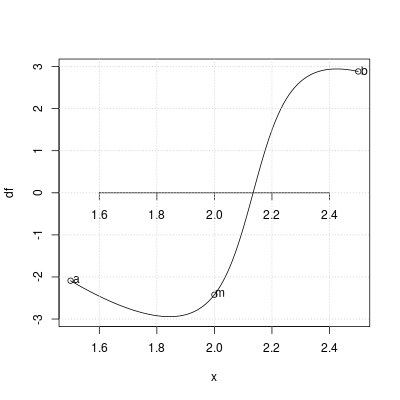

# Wizualizacja - bisekcja - animacja - iteracja 1
\centering 
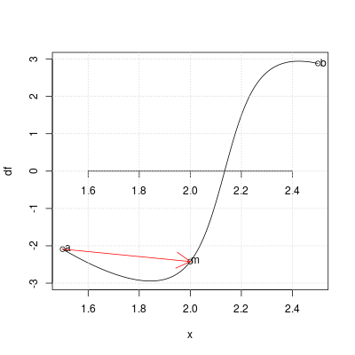

# Wizualizacja - bisekcja - animacja - iteracja 2
\centering 


# Wizualizacja - bisekcja - animacja - iteracja 2
\centering 
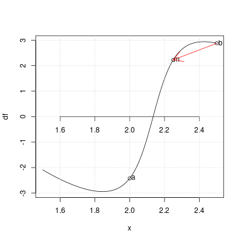

# Wizualizacja - bisekcja - animacja - iteracja 3
\centering 
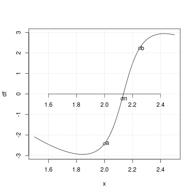

# Wizualizacja - bisekcja - animacja - iteracja 3
\centering 
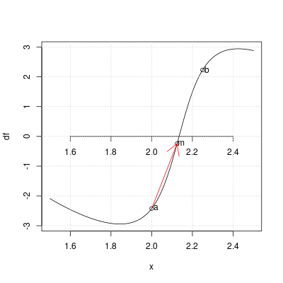

# Wizualizacja - bisekcja - animacja - iteracja 4
\centering 
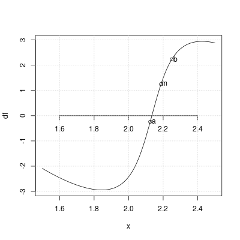

# Wizualizacja - bisekcja - animacja - iteracja 4
\centering 
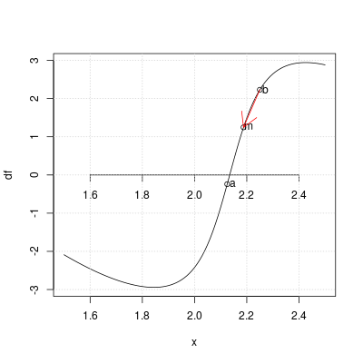

# Wizualizacja - bisekcja - animacja - iteracja 5
\centering 
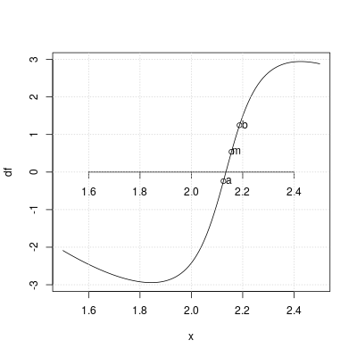

# Wizualizacja - bisekcja - animacja - iteracja 5
\centering 
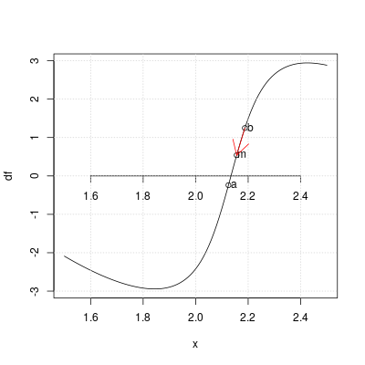

# Wizualizacja - bisekcja - animacja - iteracja 6
\centering 


# Wizualizacja - bisekcja - animacja - iteracja 6
\centering 
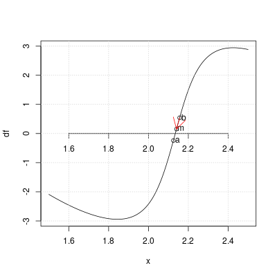

# Wizualizacja - bisekcja - animacja - iteracja 7
\centering 
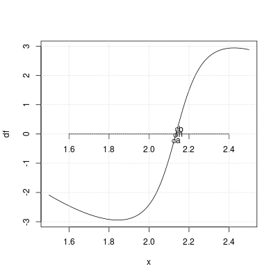

# Wizualizacja - bisekcja - animacja - iteracja 7
\centering 
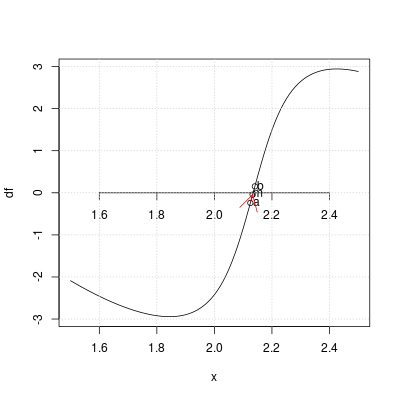

# Podsumowanie

Oba algorytmy znalazły minimum w zadanym przedziale z zadaną dokładnością. 
Ich porównanie znajduje się poniżej:

| Algorytm | X      | f(X)     | Iteracje |
|----------|--------|----------|------------|
| Fibonacci | 2.134868 | 0.5240011 | 16 |
| Bisection | 2.13501  | 0.5240023 | 10 |

Metoda Fibonacciego osiągnęła lepszą dokładność, ale kosztem wykonania większej
ilości iteracji. Jednak mimo tego, Algorytm Fibonacciego będzie w przypadku tej funkcji lepszy, 
gdyż nie musimy obliczać jej pochodnej. 

W przypadku algorytmu Bisekcji można by go przyspieszyć, obliczając wsześniej pochodną
metodą analityczną. 
