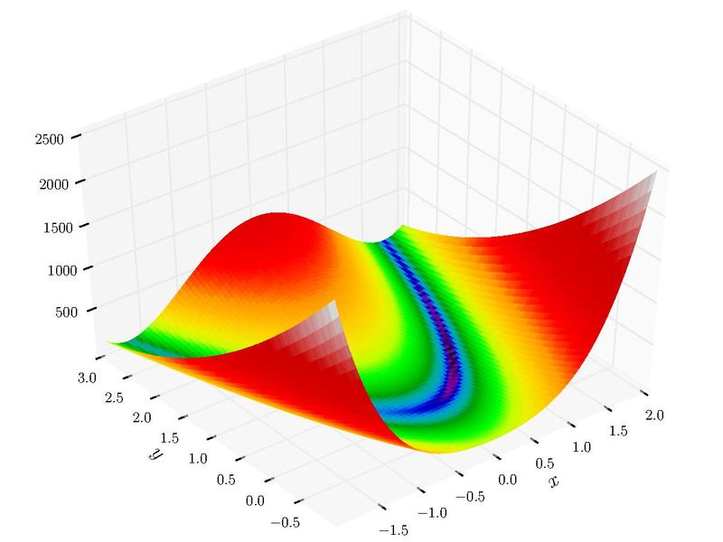

```{r setup, include=FALSE, warning=FALSE}
library(knitr)
hook_output <- knit_hooks$get("output")
knit_hooks$set(output = function(x, options) {
  lines <- options$output.lines
  if (is.null(lines)) {
    return(hook_output(x, options))  # pass to default hook
  }
  x <- unlist(strsplit(x, "\n"))
  more <- "..."
  if (length(lines)==1) {        # first n lines
    if (length(x) > lines) {
      # truncate the output, but add ....
      x <- c(head(x, lines), more)
    }
  } else {
    x <- c(more, x[lines], more)
  }                                                         
  # paste these lines together                              
  x <- paste(c(x, ""), collapse = "\n")                     
  hook_output(x, options)                                   
})                                                          
knitr::opts_chunk$set(echo = TRUE)                          
knitr::opts_chunk$set(cache = TRUE) 
knitr::opts_chunk$set(echo = TRUE, fig.align="center")
Sys.setlocale("LC_ALL", "Polish")
```
# Wstęp

Celem tej pracy jest omówienie metody gradientów sprzężonych Polaka-Ribiere'a,
jej implementacja w R oraz rozwiązanie z jej pomoca zadania optymalizacyjnego.

# Problem

Istnieje wiele algorytmów optymalizacji co zrodziło potrzebę porównania ich, wyłonienia, który jest najlepszy. Do tego celu powstały funkcje testujące algorytmy optymalizacji ^[https://en.wikipedia.org/wiki/Test_functions_for_optimization] . Ich pierwszy zbiór został stworzony jako pakiet w programie Matlab przez Rody Oldenhuis i zawierał 50 funkcji testowych.

{ width=50% }

# Inne przykłady: Funkcja Rosenbrock'a oraz Goldstein'a-Price'a


{ width=45% } { width=45% }

# Zadanie

Zadaniem będzie znalezienie minimum funkcji Goldstein'a-Price'a o następującym równaniu:

$$
f(x,y)=\left[1+\left(x+y+1\right)^{2}\left(19-14x+3x^{2}-14y+6xy+3y^{2}\right)\right]
$$

```{r}

f <- function(x, y) {
  (1 + (x + y + 1)^2 * 
  (19 - 14 + 3*x^2 - 14*y + 6*x*y + 3*y^2)) *
  (30 + (2*x - 3*y)^2*(18 - 32*x + 12*x^2 
      + 48*y-36*x*y + 27*y^2))
}
```


# Wykres funkcji

```{r, echo=FALSE}
x <- seq(-1.5, 1.5, length.out=200)
y <- seq(-1.5, 1.5, length.out=200)
z <- outer(x, y, f)
contour(x, y, z, levels=seq(0, 100, 2)^2)
```

# Wykres funkcji - zbliżenie na miejsce zerowe

```{r, echo=FALSE}
x <- seq(-1, 1, length.out=200)
y <- seq(-1.4, 0, length.out=200)
z <- outer(x, y, f)
contour(x, y, z, levels=seq(0, 100, 2)^2)
```


```{r}
x <- seq(-0.5, 0.5, length.out=50)
y <- seq(-1.4, 0, length.out=50)
z <- outer(x, y, f)

for (i in seq(1, 90, 10)){
 persp(x,y,z, theta=i,phi=30,expand=0.4,col = "lightblue",xlab = "X",
 ylab = "Y", zlab = "Z",ticktype = "detailed")
}
```

# Plotly
```{r echo=FALSE, fig.height=8, fig.width=12, message=FALSE, warning=FALSE, paged.print=FALSE}
library(plotly)
x <- seq(-1.2, 0.5, length.out=50)
y <- seq(-1, 0, length.out=50)
z <- outer(x, y, f)

fig <- plot_ly()
fig <- fig %>% add_surface(z = z, x = x, y  = y, colorscale = "Rainbow")
fig
```
