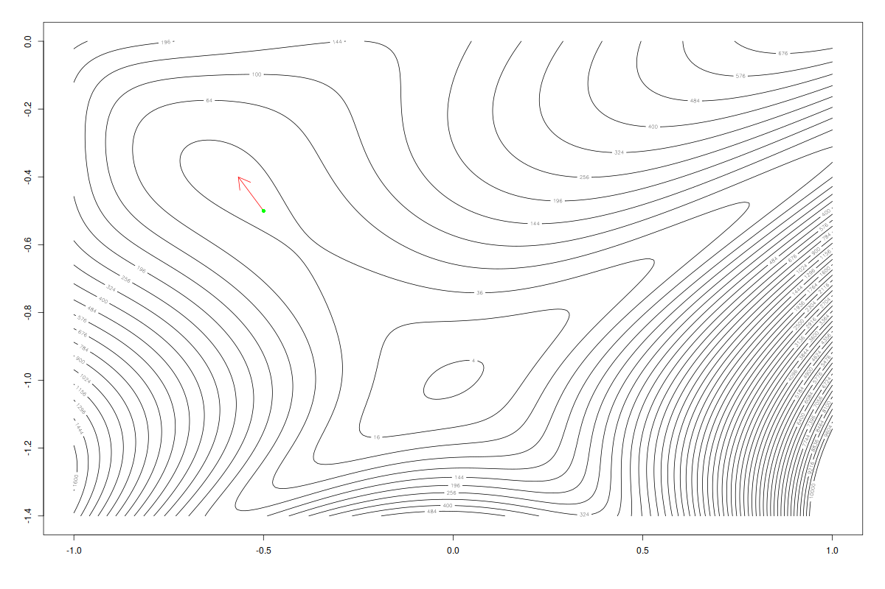

```{r setup, include=FALSE, warning=FALSE}
library(knitr)
hook_output <- knit_hooks$get("output")
knit_hooks$set(output = function(x, options) {
  lines <- options$output.lines
  if (is.null(lines)) {
    return(hook_output(x, options))  # pass to default hook
  }
  x <- unlist(strsplit(x, "\n"))
  more <- "..."
  if (length(lines)==1) {        # first n lines
    if (length(x) > lines) {
      # truncate the output, but add ....
      x <- c(head(x, lines), more)
    }
  } else {
    x <- c(more, x[lines], more)
  }                                                         
  # paste these lines together                              
  x <- paste(c(x, ""), collapse = "\n")                     
  hook_output(x, options)                                   
})                                                          
knitr::opts_chunk$set(echo = TRUE)                          
knitr::opts_chunk$set(cache = TRUE) 
knitr::opts_chunk$set(echo = TRUE, fig.align="center")
Sys.setlocale("LC_ALL", "Polish")
```
# Wstęp

Celem tej pracy jest omówienie metody gradientów sprzężonych Polaka-Ribiere'a,
jej implementacja w R oraz rozwiązanie z jej pomoca zadania optymalizacyjnego.

# Problem

Istnieje wiele algorytmów optymalizacji co zrodziło potrzebę porównania ich i wyłonienia, który jest najlepszy. Do tego celu powstały funkcje testujące algorytmy optymalizacji ^[https://en.wikipedia.org/wiki/Test_functions_for_optimization] . Ich pierwszy zbiór został stworzony jako pakiet w programie Matlab przez Rody Oldenhuis i zawierał 50 funkcji testowych.

{ width=50% }

# Inne przykłady: Funkcja Rosenbrock'a oraz Goldstein'a-Price'a


{ width=45% } { width=45% }

# Zadanie

Zadaniem będzie znalezienie minimum funkcji Goldstein'a-Price'a o następującym równaniu:

$$
f(x,y)=\left[1+\left(x+y+1\right)^{2}\left(19-14x+3x^{2}-14y+6xy+3y^{2}\right)\right]$$
$$
\left[30 + (2x - 3y)^2 (18 - 32x + 12x^2 + 48y - 36 xy + 27y^2) \right]
$$

```{r}

f <- function(x, y) {
  (1 + (x + y + 1)^2 * 
  (19 - 14 + 3*x^2 - 14*y + 6*x*y + 3*y^2)) *
  (30 + (2*x - 3*y)^2*(18 - 32*x + 12*x^2 
      + 48*y-36*x*y + 27*y^2))
}
```

# Wykresy funkcji - wstęp

Na następnych slajdach umieściłem dwa typy wykresów. 

Pierwszy z nich to konturowy, patrzymy na funkcję z góry i oznaczone mamy kolejne jej poziomy. Uwaga: te poziomy nie są równo oddalone, są to kolejne drugie potęgi cyfr od 0 do 100. Z tego wykresu możemy odczytać, że minimum jest gdzieś w okolucy punktu $(0, -1)$.

Drugim typem wykresu jest wykres 3d, ukazany jest on z kilku perspektyw.


# Wykres funkcji

```{r, echo=FALSE}
x <- seq(-1.5, 1.5, length.out=200)
y <- seq(-1.5, 1.5, length.out=200)
z <- outer(x, y, f)
contour(x, y, z, levels=seq(0, 100, 2)^2)
```

# Wykres funkcji - zbliżenie na miejsce zerowe

```{r, echo=FALSE}
x <- seq(-1, 1, length.out=200)
y <- seq(-1.4, 0, length.out=200)
z <- outer(x, y, f)
contour(x, y, z, levels=seq(0, 100, 2)^2)
```

```{r eval=FALSE, include=FALSE}
x <- seq(-0.5, 0.5, length.out=50)
y <- seq(-1.4, 0, length.out=50)
z <- outer(x, y, f)

for (i in seq(1, 90, 10)){
 jpeg(filename = paste("img/", i ,".jpeg" ,sep=""),  width = 1200, height = 900)
 cat(paste("img/", i ,".jpeg", "\n" ,sep=""))
 persp(x,y,z, theta=i,phi=30,expand=0.4,col = "lightblue",xlab = "X",
 ylab = "Y", zlab = "Z",ticktype = "detailed")
 dev.off()
}
```
# Wykres - 3D


# Wykres - 3D


# Wykres - 3D


# Wykres - 3D


# Wykres - 3D


# Wykres - 3D


# Wykres - 3D


# Wykres - 3D


# Wykres - 3D


# Wykres w plotly

```{r fig.height=8, fig.width=12}
library(plotly)
x <- seq(-1.2, 0.5, length.out=50)
y <- seq(-1, 0, length.out=50)
z <- outer(x, y, f)

fig <- plot_ly()
fig <- fig %>% add_surface(z = z, x = x, y  = y, colorscale = "Rainbow")
fig
```

# Metoda gradientów sprzężonych Polaka-Ribiere'a

Jest to iteracyjna metoda optymalizacji bez ograniczeń. Odróżnia się od innych
metod gradientowych tym, iż do oblizenia kolejnego kierunku poszukiwań korzysta
z gradientu z poprzedniej iteracji (stąd sprzężenie w nazwie). Ogólna zasada jest
podobna do metod gradientowych, w kroku pierwszym poszukujemy gradientu, który 
wskaże nam kierunek poszukiwania najmniejszego punktu:
$$ d(0) = - \nabla f(x^{(0)}) $$

Następnie w każdym z kolejnych $d^{(i+1)}$, uwzględniać będziemy $\beta$, które 
zawiera gradient.
$$ d^{(i+1)} = - \nabla f(x^{(i+1)}) + \beta^{(i+1)} d^{(i)} $$
Gdzie:
$$ \beta^{i+1} =  \frac{\nabla f(x^{(i+1)})^T \left( \nabla f(x^{(i+1)}) - \nabla f(x^{(i)}) \right) }{\nabla f(x^{(i)})^T \nabla f(x^{(i)})} $$

# Metoda gradientów sprzężonych Polaka-Ribiere'a

I ostatecznie, kolejne przybliżenie szukanego minimum można znaleźć:
$$ x^{(i+1)} =x^{(i)} + h^{(i)}*d^{(i)}$$
Przy czym, h - długość kroku można wyznaczyć na kilka sposobów. Najbardziej
optymalnym jest aktualizacja tej wartości w każdej iteracji. Można to robić poszukując
minium funkcji wzdłóż kierunku poszukiwań $d$.
$$ g(\alpha) = f(x^{(i)} + \alpha d^{(i)})$$
Wtedy, dla dla znalezionego $g_{min}$ i $\alpha_{min}$:
$$ h^{(i)} =  \alpha_{min}$$
Minium funkcji $g$ poszukuje się z pomocą metod optymalizacji jednowymiarowej.


# Metody optymalizacji jednowymiarowej - mały (wielki) problem

I tutaj pojawia się mały problem, metody optymalizacji jednowymiarowej wymagają
podania przedziału, w którym może znajdować się minimum. Może zdarzyć się tak, że
dla dużych $d$, źle dobrany przedział poszukiwań $[a, b]$ sprawi, że krok $h^{(i)}$
będzie bardzo duży i nie trafimy w minimum. Co może się zdarzyć dla bardzo 
"płaskich" funkcji. 

Dokładnie na taki problem natrafiłem podczas pracy. Funkcja w okolicach minimum
posiadała bardzo duży gradient i w następnej iteracji $x$ znacząco oddalał się od 
minimum.

Algorytm był zbieżny wyłącznie dla minimum, oddalenie się o $0.01$ powodowało rozbieżność.

# Próba rozwiązania problemu

Pierwszą rzeczą, której spróbowała najoczywistsza rzecz tj. ograniczenie gradientu.
W przypadku gdy stawał się zbyt duży, dzieliłem go przez jego długość. Sprawdziło
się to wyłącznie w początkowych iteracjach, ponieważ gdyż w przypadku gdy krok $h^{(i)}$
otrzymany przez metodę optymalizacji jednowymiarowej był zbyt duży, nadal 
oddalałem się od minimum.

# Rozwiązanie problemu

Zmiana gradientu okazała się nietrafionym pomysłem, ponieważ przy okazji zmieniał
się parametr $\beta$. Zamiast tego zmieniłem przedział poszukiwań optymalnego kroku,
ponieważ to on ostatecznie był dodawany do $x$. Idelnym przedziałem okazał się
$$ [a, b] = \left[ max \left\{\frac{-1}{|d|}, -|d| \right\} , min \left\{\frac{1}{|d|}, |d| \right\} \right] $$
W przypadku bardzo dużych $d$, przedział poszukiwań był bardzo zawężany, co 
sprawiało, że krok także się zmiejszał.

Próbowałem także zmienić algorytm optymailzacji jednowymiarowej i dla podanej funkcji
jedynym, który zadziałał był algorytm golden. Z algorytmem Fibonacciego już w drugiej
iteracji (dla tych samych parametrów) $x$ stawał się duży, a algorytm nie był zbieżny.

# Algorytm golden

```{r}
golden <- function(f, lower, upper, tol) {
  ratio <- 2 / (3 + sqrt(5))
  x1 <- (1 - ratio) * lower + ratio * upper
  f.x1 <- f(x1)
  while (abs(upper - lower) > 2 * tol) {
    x2 <- (1 - ratio) * x1 + ratio * upper
    f.x2 <- f(x2)
    if (f.x1 < f.x2) {
      upper <- lower
      lower <- x2
    } else {
      lower <- x1
      x1 <- x2
      f.x1 <- f.x2
    }
  }
return((upper + lower) / 2)
}
```

# Metoda gradientów sprzężonych Polaka-Ribiere'a - kod w R

\tiny
```{r}
library(numDeriv)
polak.ribiere <- function(f, x, tol) {
  beta <- 1; i <- 1;
  d <- -grad(f, x,)
  repeat {
    g <- function(a) {f(x + a * d)}
    d.magnitude <- sqrt(sum(d^2));
    grad.x <- grad(f, x)
    step <- golden(g,
                max(c(-1/d.magnitude,-d.magnitude)), 
                min(c(1/d.magnitude,d.magnitude)), tol)
    new.x <- x + step * d
    grad.new.x <- grad(f, new.x)
    cat("(",i,")", "x=", x,"step=",step, "new.x=", new.x, "grad.x=", 
        grad.x, "\n(",i,")", "grad.new.x=", grad.new.x, "d=", d, "\n");
    if (dist(rbind(new.x,x)) < tol) {
      return(new.x)
    }
    beta <- t(grad.new.x) %*%
              (grad.new.x - grad.x) /
              (t(grad.x) %*% grad.x)
    d <- -grad(f,new.x) + as.vector(beta) * d;
    x <- new.x; i <- i + 1;
  }
}

```
\normalsize

# Rozwiązanie zadania

\tiny
```{r}
fn <- function(x) f(x[1], x[2]);
m <- polak.ribiere(fn, c(-0.5, -0.5), 1e-3)

```
\normalsize

# Rozwiązanie zadania - sprawdzenie

Wynik ten pokrywa się z rozwiązaniem podawanym przez WolframAlpha


# Rozwiązanie - wizualizacja

Na kolejnych slajdach zwizualizowałem pracę algorytmu. Na każdym z nich znajduje się
wykres konturowy funkcji, a także strzałka reprezentująca krok, który wykonał 
algorytm w danej iteracji.

Zielony punkt wskazuje miejsce, z którego algorym rozpoczynał pracę.

# Rozwiązanie - wizualizacja

```{r eval=FALSE, include=FALSE}
con <- function() {
x <- seq(-1, 1, length.out=200)
y <- seq(-1.4, 0, length.out=200)
z <- outer(x, y, f)
contour(x, y, z, levels=seq(0, 100, 2)^2)}

```


```{r eval=FALSE, include=FALSE}
library(numDeriv)
polak.ribiere.anim <- function(f, x, tol) {
  beta <- 1; i <- 1;
  d <- -grad(f, x,)
  start.x <- x;
  repeat {
    g <- function(a) {f(x + a * d)}
    d.magnitude <- sqrt(sum(d^2));
    grad.x <- grad(f, x)
    step <- golden(g,
                max(c(-1/d.magnitude,-d.magnitude)), 
                min(c(1/d.magnitude,d.magnitude)), tol)
    new.x <- x + step * d
    grad.new.x <- grad(f, new.x)
    cat("(",i,")", "x=", x,"step=",step, "new.x=", new.x, "grad.x=", 
        grad.x, "\n(",i,")", "grad.new.x=", grad.new.x, "d=", d, "\n");
    if (dist(rbind(new.x,x)) < tol) {
      return(new.x)
    }
    beta <- t(grad.new.x) %*%
              (grad.new.x - grad.x) /
              (t(grad.x) %*% grad.x)
    d <- -grad(f,new.x) + as.vector(beta) * d;
    con()
    arrows(x[1], x[2], new.x[1], new.x[2], col="red")
    points(start.x[1], start.x[2], col="green", pch=16)
    dev.print(png, paste("img/Z", i, ".png", sep=""), width = 1200, height = 800)
    x <- new.x; i <- i + 1;
  }
}
```

```{r eval=FALSE, include=FALSE}
con()
fn <- function(x) f(x[1], x[2]);
m <- polak.ribiere.anim(fn, c(-0.5, -0.5), 1e-3)
```




# Rozwiązanie - wizualizacja


# Rozwiązanie - wizualizacja


# Rozwiązanie - wizualizacja


# Rozwiązanie - wizualizacja


# Rozwiązanie - wizualizacja


# Rozwiązanie - wizualizacja


# Rozwiązanie - wizualizacja


# Rozwiązanie - wizualizacja


# Rozwiązanie - wizualizacja


# Podsumowanie

Omówiona funkcja nie jest trywialna dla tego algorytmu. W wersja omówiona na wykładzie
nie znajdowała minimum, nawet gdy byliśmy bardzo blisko. Przedstawione modyfikacje algorytmu
poprawiły jego działanie na tej funkcji, jednak nie wiadomo czy to rozwiązanie poprawiło
by jakość działania algorytmu, gdyby użyto innej funkcji.
 
Niemniej jak wynika z poprzedniej animacji, nawet wprowadzona zmiana nie jest idealna,
algorytm w pierwszym wypadku nie zbiega do minimum globalnego, ale na moment wchodzi
w lokalne jednak niemal natychmiast wraca w okolicę globalnego.

# Załączniki i informacje dodatkowe

Prezentacja została wykonana w Rmarkdown i wyeksportowana z pomocą beamer.

Załączniki do pliku pdf:
- Plik Rmd - do reprodukcji wyników
- Plik html - ta sama prezentacja, ale z dodatkowym interaktywnym wykresem w plotly
