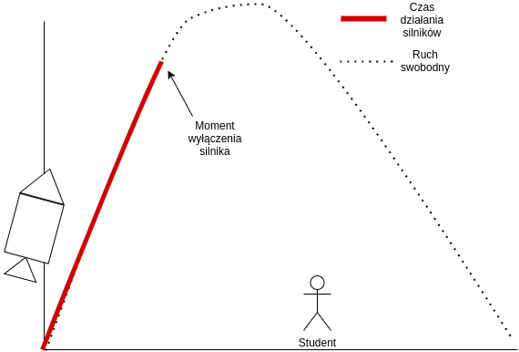

```{=tex}
\vspace{8cm}
{\raggedleft
\vfill{
  \large Piotr Krawiec L1 \vspace{0.2cm} \\
  \large Semestr: 2021/2022 \vspace{0.2cm} \\
  \large Kierunek: III/FS0-DI \vspace{0.2cm} \\
  \large Numer indeksu: 164165 \vspace{0.2cm} \\
}\par}
\newpage
\tableofcontents
\newpage
```

```{r setup, include=FALSE, warning=FALSE}
library(knitr)
hook_output <- knit_hooks$get("output")
knit_hooks$set(output = function(x, options) {
  lines <- options$output.lines
  if (is.null(lines)) {
    return(hook_output(x, options))  # pass to default hook
  }
  x <- unlist(strsplit(x, "\n"))
  more <- "..."
  if (length(lines)==1) {        # first n lines
    if (length(x) > lines) {
      # truncate the output, but add ....
      x <- c(head(x, lines), more)
    }
  } else {
    x <- c(more, x[lines], more)
  }                                                         
  # paste these lines together                              
  x <- paste(c(x, ""), collapse = "\n")                     
  hook_output(x, options)                                   
})                                                          
knitr::opts_chunk$set(echo = TRUE)                          
knitr::opts_chunk$set(cache = TRUE)                         
Sys.setlocale("LC_ALL", "Polish")
```

# Treść zadania
Grupa studentów pracuje nad modelem rakiety na paliwo stałe. Ich zadaniem jest 
wysłanie ładunku na jak największą wysokość, dostosowując tempo spalania paliwa 
(czas pracy silnika). Studenci mają do dyskozycji rakietę
o nasępujących parametrach:

- $Isp$ = 150 - impuls właściwy silnika
- $m_o$ = 500 kg - masa rakiety (paliwo + masa ładunku)
- $m_{final}$ = 100 kg - masa ładunku

Dla uproszczenia przyjęto $Isp$ jest stałe, niezależne od czasu działania silnika oraz, że rakieta osiągnie maksimum wysokości gdy wysokość na której wyłączy silniki 
będzie maksymalna dla zadanych parametrów rakiety.



Równanie^[https://web.mit.edu/16.unified/www/SPRING/propulsion/notes/node103.html], które opisuje na jakiej wysokości wyłączą się silniki wygląda następująco:
$$
h(t) =  g \left[ -t \cdot Isp \cdot 
  \frac{
    ln(\frac{m_o}{m_{final}})}
    {\left(\frac{m_o}{m_{final}}  - 1\right)}
  + t \cdot Isp - \frac{1}{2} \cdot t^{2}
  \right]
$$

```{r}
plot(cars)
```
