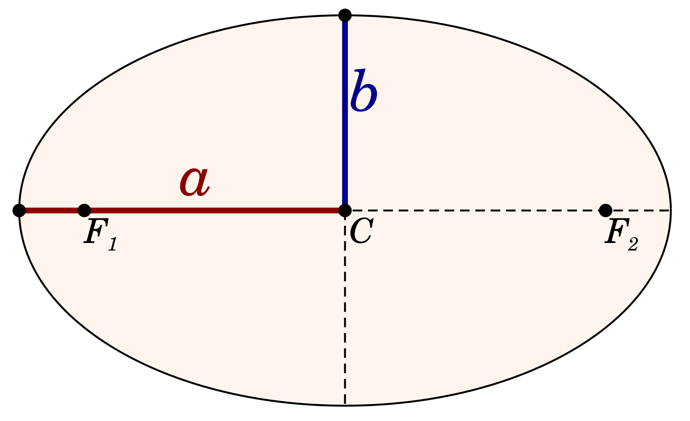

```{r setup, include=FALSE, warning=FALSE}
library(knitr)
hook_output <- knit_hooks$get("output")
knit_hooks$set(output = function(x, options) {
  lines <- options$output.lines
  if (is.null(lines)) {
    return(hook_output(x, options))  # pass to default hook
  }
  x <- unlist(strsplit(x, "\n"))
  more <- "..."
  if (length(lines)==1) {        # first n lines
    if (length(x) > lines) {
      # truncate the output, but add ....
      x <- c(head(x, lines), more)
    }
  } else {
    x <- c(more, x[lines], more)
  }                                                         
  # paste these lines together                              
  x <- paste(c(x, ""), collapse = "\n")                     
  hook_output(x, options)                                   
})                                                          
knitr::opts_chunk$set(echo = TRUE)                          
knitr::opts_chunk$set(cache = TRUE) 
knitr::opts_chunk$set(echo = TRUE, fig.align="center")
Sys.setlocale("LC_ALL", "Polish")
```


# Zadanie

Dystans Ziemia-Mars zależy od ich pozycji na orbitach i zmienia się w czasie. 
Zadaniem jest obliczenie najmniejszego dystansu na jaki planety te zbliżą się.
Dla ułatwienia orbity obu planet zostaną zamodelowane jako elipsy.


# Pozycja planety w dowolnym punkcie czasu

Pozycje planet mogą być modelowane z pomocą liczb zespolonych^[https://www.johndcook.com/blog/2015/10/24/distance-to-mars/]. 
Oto równanie  pozwalające na symulację ruchu planety. Zostanie ono odpowienio przeskalowane 
poprzez dostosowanie parametru $r$. Model zakłada, że początkowy kąt między planetami
wynosi 0 rad.

$$
planet(t) = r * exp \left(2 \cdot \pi i r^{\frac{-3}{2}} t \right)
$$

- $r$ - półoś wielka orbity planety (elipsy)
- $AU$ - jednostka astronomiczna 149 597 870 700 m
- $t$ - czas^[jednostka nie ma znaczenia, ponieważ szukamy najmniejszej odległości]

# Elipsa

Oto model orbity. Dostosowując parametr $r$ (na rys $a$), możemy modelować 
dowolną z planet.

- $a$ - półoś wielka elipsy
- $b$ - półoś mała elipsy


{width=70%}

# Równanie dla ziemi i marsa

Ponieważ półoś wielka orbity Ziemi wokół słońca to $1 AU$ przyjmiemy parametr $r = 1 AU$.

$$
earth(t) = exp \left(2 \cdot \pi \cdot i \cdot t \right)
$$

Ponieważ półoś wielka orbity Marsa wokół słońca to $1.524 AU$ przyjmiemy parametr $r = 1.524 AU$.

$$
mars(t) = 1.524 * exp \left(2 \cdot \pi \cdot i \cdot (1.524)^{\frac{-3}{2}} \cdot t \right)
$$

# Równanie dla ziemi i marsa - kod w R

```{r}
r = 1.524 # półoś wielka orbity Marsa w AU

earth <- function(t){ exp(2*pi*1i*t) }

mars <- function(t) { r*exp(2*pi*1i*(r**-1.5*t)) }
```

Odległość między planetami można wyznaczyć jako wartość bezwzględą z różnicy 
w ich pozycjach w czasie $t$.

$$
f(t) = abs \left( mars(t) - earth(t) \right)
$$

```{r}
f <- function(x) { abs(mars(x) - earth(x)) }
```

# Wykres funkcji odległości planet

```{r, fig.cap = 'Wykres funkcji distance(t)', echo=FALSE, out.width = '80%'}
plot(f, xlim = c(0, 5), ylim = c(0, 3), xlab = "Time", ylab = "Distance [AU]")
```

# Wykres funkcji odległości planet - porównanie z sin

Przeskalowana funkcja $sin(x)$ na czerwono. Funkcja dystansu przypomina funkcję 
sinus, ale jak widać na wykresie poniżej nie są identyczne.

```{r, fig.cap = 'Wykres funkcji distance(t)', echo=FALSE, out.width = '60%'}
plot(f, xlim = c(0, 5), ylim = c(0, 3), xlab = "Time", ylab = "Distance [AU]")
plot(function(x) sin(2.85*x - 1.4) + 1.5, xlim = c(0, 5), ylim = c(0, 3), xlab = "Time", ylab = "Distance [AU]", add=TRUE, col="red")
```
# Metody bezgradientowe 

Zadanie zostanie roziwązane korzystając z metody Fibonacciego. Do jej implementacji
będzie potrzebny *Ciąg Fibonacciego*, który zdefiniowany jest jako:
$$
F(0) = 0, F(1) = 1, F_n = F_{n-1} + F_{n-2}
$$

# Obliczenie Ciągu Fibonacciego
\small
```{r}
# Obliczenie pierwszych 101 wyrazów ciągu fib
phil <- c(rep(0, 100))
phil[1:3] <- c(1,1,1)
for(i in c(3:length(phil))) {phil[i] = phil[i-1]
  + phil[i-2]}

phi <- function(i) {
  if(i == 0) {return(0)}; # F(0) = 0
  # Obliczenie nowych elementów jeżeli wyjdziemy poza zakres
  if (i > length(phil)) { 
    len <- length(phil)
    phil <- c(phil, rep(0, i - len))
    for(j in c(len:length(phil))) {phil[j] = phil[j-1] 
      + phil[j-2]}
  }
  return(phil[i])
}
```
\normalsize

# Metoda Fibonacciego
Metoda ta opiera się na metodzie zawężania początkowego przedziału poszukiwania.
Zaczynamy od wybrania przedziału $[a, b]$. Nastepnie w każdej iteracji obliczamy
punkty $c^{(i)}$ oraz $d^{(i)}$, tak aby spełniały:
$$
b^{(i)} - d^{(i)} = c^{(i)} - a^{(i)}
$$
oznacza to, że są równo oddalone od aktualnego przedziału przeszukiwań.

# Metoda Fibonacciego

Wyznaczanie punktów $c^{(i)}$ oraz $d^{(i)}$. 
$$
c^{(i)} = b^{(i)} - \alpha^{(i)} \cdot \left( b^{(i)} - a^{(i)} \right)
$$

$$
d^{(i)} = a^{(i)} + b^{(i)} - c^{(i)}
$$

$$
\alpha^{(i)} = \frac{\phi_{k-i-1}}{\phi_{k-i}}
$$

$$
\phi_k = min \{ F(k): F(k) > \frac{L}{\epsilon} \}
$$
Gdzie: $F(k)$ to k-ty wyraz *Ciągu Fibonacciego*, $L$ = | a - b |, $\epsilon$ - zadana dokładność

# Jak działa zawężanie przedziału poszukiwań
- Gdy: $f(c) < f(d)$, wtedy $a^{(i+1)} = a^{(i)}, b^{(i+1)} = d^{(i)}$
- Gdy: $f(d) < f(c)$, wtedy $a^{(i+1)} = c^{(i)}, b^{(i+1)} = d^{(i)}$

```{r, echo=FALSE, out.width = '80%'}
fun <- function(x){x^2}
plot(fun, -2, 2)
xp <- c(-1,-0.5, 1,1.5)
yp <- fun(xp)
points(xp, yp, pch=19)
text(xp+0.1,yp+0.1, c("a","c","d", "b"))
```


